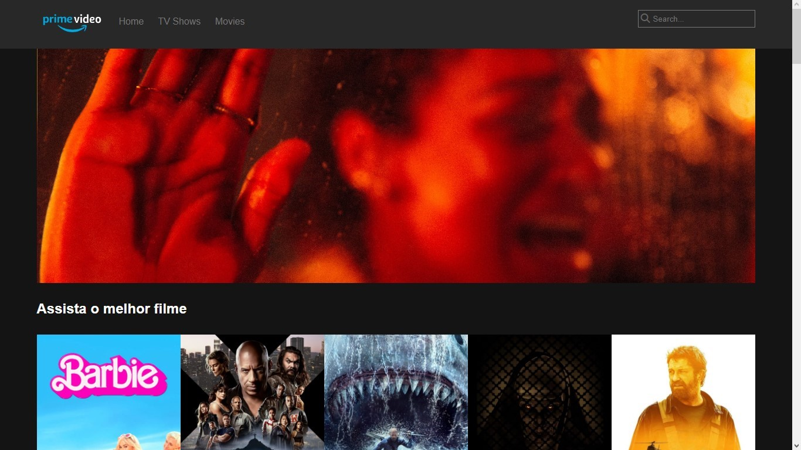

<h1 align="center">.:| Prime Video Clone |:.</h1>

 

<h2 align="center">📖Descrição</h2>

Clone do site Amazon Prime Video, desenvolvido com HTML5, CSS3 e Javascript vanilla no curso danki code front-end completo. Usando flexbox, método fecth para puxar o conteudo de forma dinamica da API do site www.themoviedb.org.

 

<h2 align="center">🖥Preview</h2>

</img>

 

### Veja o projeto funcionando <a href="https://kevynfirst.github.io/primevideo-clone">aqui</a>. 👈

 

<h2 align="center">🛠 Tecnologias</h2>

- [HTML5](https://html.com/)
- [CSS3](https://developer.mozilla.org/pt-BR/docs/Web/CSS)
- [Javascript](https://www.javascript.com)
- [TheMovieDb](https://www.themoviedb.org/signup)

 

<h2 align="center">😉 Obrigado por visitar meu projeto</h2>

Você pode conferir outros projetos que desenvolvi aqui no meu GitHub, ou entrar em contato comigo pelos demais links.

